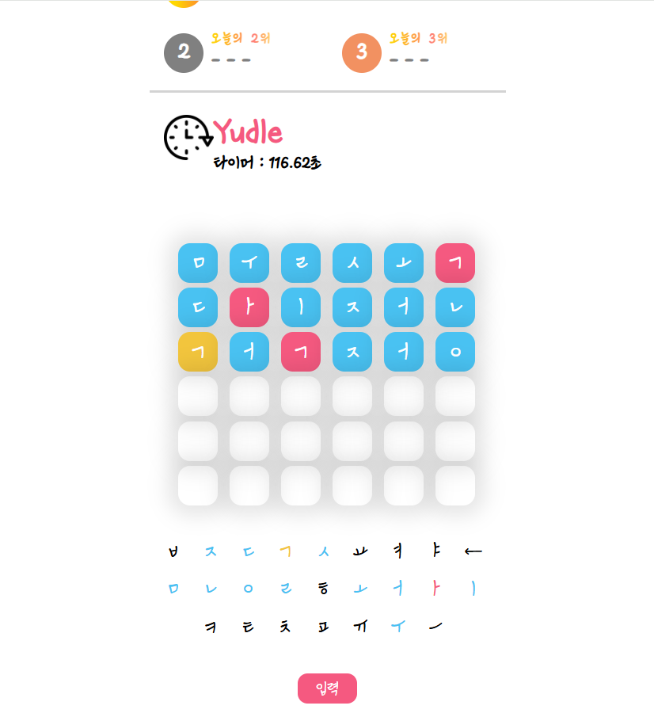
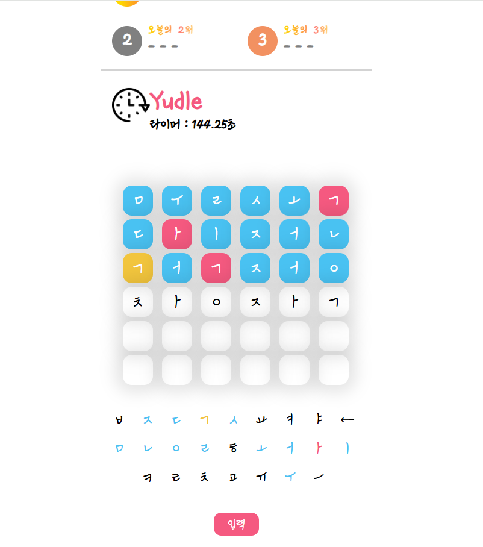
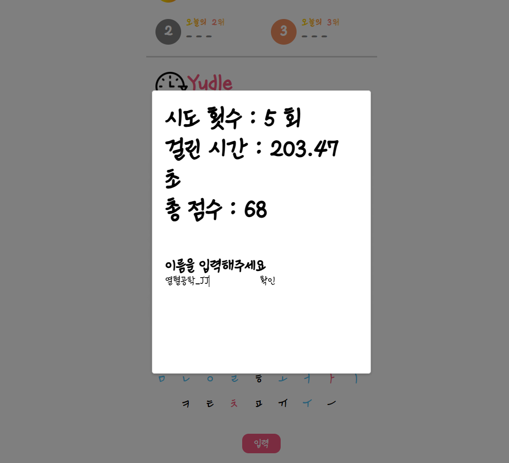
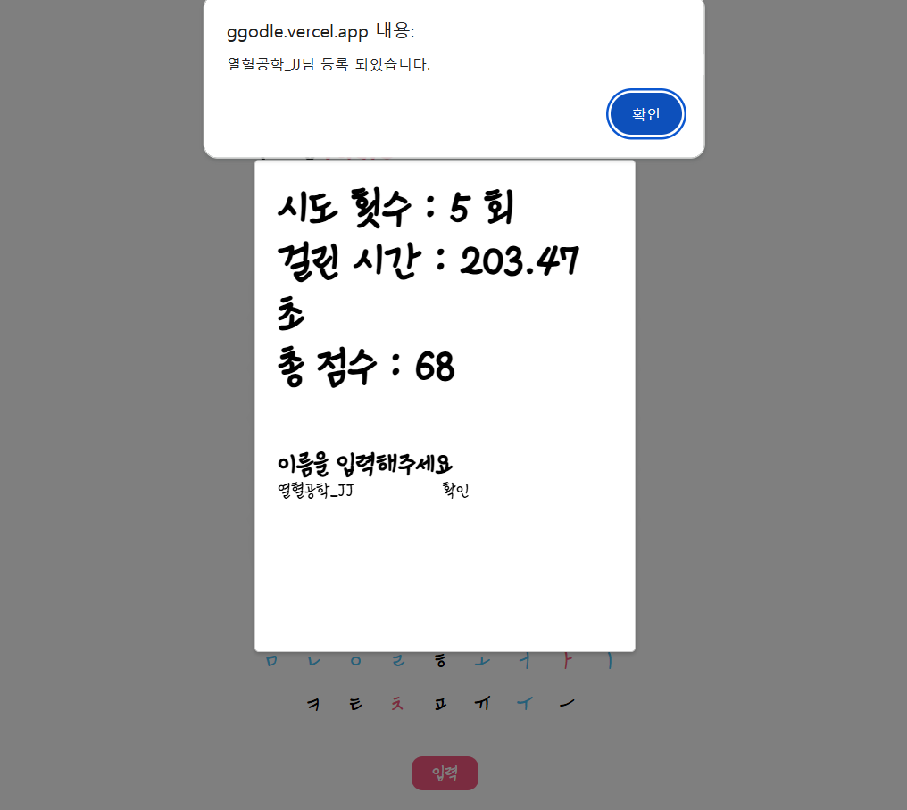
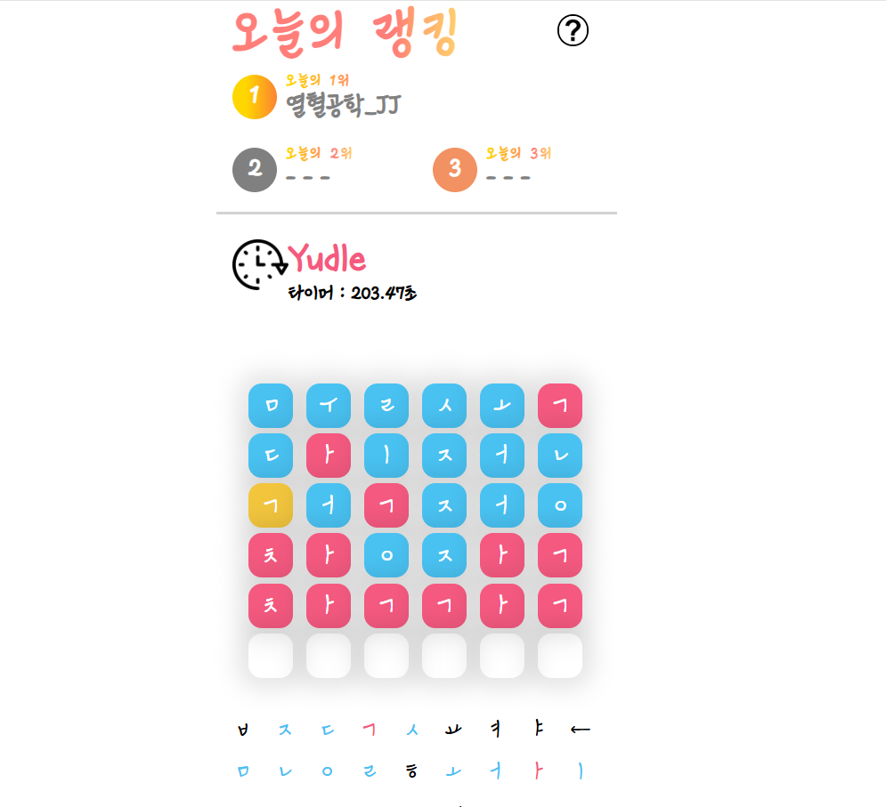
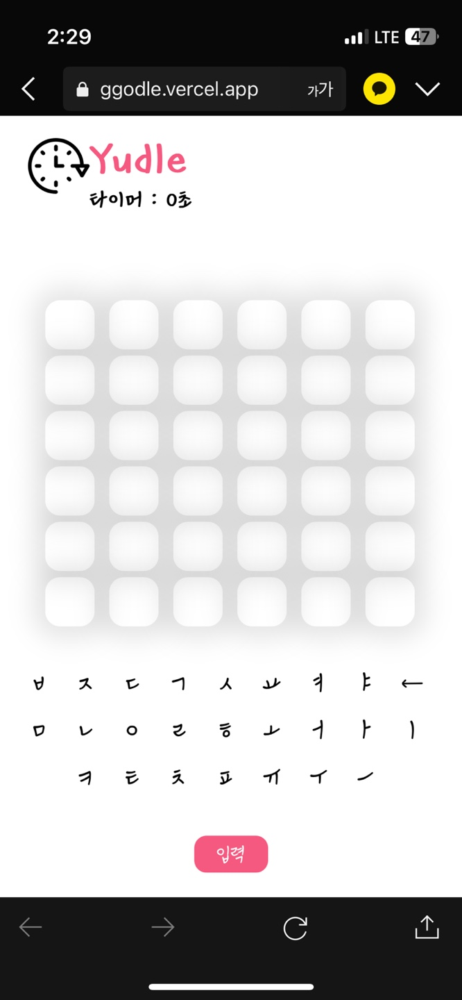

## 🔎 프로젝트 소개  

위 프로젝트는 다음과 같은 배경에서 진행된 Kordle 게임의 클론 프로젝트 입니다.
- 자음 모음 6개를 맞추는 kordle 이라는 게임이 친구들 사이에서 유행하기 시작함.
- kordle 게임에서 랭킹 시스템과, 타이머 시스템이 도입된다면 친구들이 게임을 더 재미있게 즐길 수 있을 것이라 생각함.
- 또한 프론트엔드, 백엔드, 배포의 과정을 한번에 진행할 수 있을 것 같아 기술 역량 증가에도 도움이 될 것이라 생각함.

클론 프로젝트의 대상인 kordle 게임은 [kordle 게임 바로가기](https://kordle.kr/) 에서 확인할 수 있습니다. 
<br>

### 1. 프로젝트 기간
 **2024.01.31 ~ 2024.12.06**

<br>

### 2. 포함 내용
1. 프로젝트 소개
2. 사용 기술 스택
3. 서비스 화면 및 기능
4. 디렉토리 구조 및 패키지 역할
5. API 구조
6. 기술적 이슈 및 해결 과정
7. 프로젝트 팀원 및 역할
   
<br>

## 🔧 사용 기술 스택

### Backend and DB
- FastAPI
- MySQL

### Frontend
- React
- Redux

### Tools
- GitHub


<br>

## 🚀 서비스 화면 및 기능
본 서비스는 [Yudle 게임 바로가기](https://ggodle.vercel.app/) 에서 확인할 수 있습니다.

### 게임 진행 화면 


- 위 사진과 같이 단어를 입력하게 되면 정답 단어와 비교하여 색깔을 다르게 표현한다.
    - 분홍색은 자모음이 정답 단어에 존재하고 자리까지 같은 것이다.
    - 노랑색은 자모음이 정답 단어에 존재하지만 자리는 다른 것이다.
    - 파란색은 자모음이 정답 단어에 존재하지 않는다.
- 추가로 단어를 입력하기 시작하는 즉시 타이머가 작동한다.

<br>

### 단어 입력 화면


- 위 사진과 같이 자음 모음을 클릭하여 단어를 입력할 수 있다.
- 위 그림의 경우 "창작" 이라는 단어를 입력했다.
- 입력 버튼을 누를 경우 "창작" 이라는 단어에 대해 검증이 시작되어 색깔이 바뀌게 된다.

<br>

### 랭킹 입력 화면


- 위 사진과 같이 정답을 맞출 경우 자신의 점수를 알 수 있고, 랭킹에 등록할 수 있다.

<br>

### 랭킹 입력 확인


- 위 사진과 같이 랭킹을 등록하게 되면면 랭킹이 등록되었다는 메시지를 보내준다.

<br>

### 오늘의 랭킹 반영 화면


- 위 사진과 같이 랭킹을 등록하게 되면 오늘의 랭킹을 확인할 수 있다.
- 더 많은 인원이 플레이하면 2,3위도 반영된다.

<br>

## 📂 디렉토리 구조 및 패키지 역할
### 루트 디렉토리 (백엔드)
```
꼬들
 ┣ kordlefront
 ┃ ┗ src
 ┣ ggoodle.py
 ┣ ggoodleDB.py
 ┣ ggoodleInfo.py
 ┗ unicode.py
 
```
1. kordlefront : yudle 게임의 React Frontend와 관련된 파일들이 있는 디렉토리
2. ggoodle.py : yudle 게임 FastAPI 서버의 메인 Controller 파일  
3. ggoodleDB.py : yudle 게임의 RDBMS 관련 처리를 담당하는 파일
4. ggoodleInfo.py : "가장 많이 쓰이는 자모음이 무엇인지?" 와 같은 kordle 원본 게임의 통계를 알기 위해 만든 파일 (Yudle 게임과는 관련 없음)
5. unicode.py : 자음 모음 분리, 결합과 같은 함수들이 있는 외부 라이브러리 파일

### kordlefront 디렉토리 (프론트엔드)
```
src
 ┣ api
 ┃ ┣ GetApi.js
 ┃ ┗ PostApi.js
 ┣ asset
 ┃ ┣ component
 ┃ ┃ ┣ AnswerBar.css
 ┃ ┃ ┣ AnswerBar.js
 ┃ ┃ ┣ background.css
 ┃ ┃ ┣ DescriptionButton.css
 ┃ ┃ ┣ DescriptionButton.js
 ┃ ┃ ┣ JamoLayout.js
 ┃ ┃ ┣ Maker.css
 ┃ ┃ ┣ Maker.js
 ┃ ┃ ┣ RankingButton.css
 ┃ ┃ ┣ RankingButton.js
 ┃ ┃ ┣ RankingHeader.css
 ┃ ┃ ┣ RankingHeader.js
 ┃ ┃ ┣ RankingLayout.css
 ┃ ┃ ┣ RankingLayout.js
 ┃ ┃ ┣ Timer.css
 ┃ ┃ ┗ Timer.js
 ┃ ┗ image
 ┃ ┃ ┣ background.png
 ┃ ┃ ┣ clock.png
 ┃ ┃ ┣ description.png
 ┃ ┃ ┗ ranking.png
 ┣ fonts
 ┃ ┗ KyoboHandwriting2023wsa.ttf
 ┣ page
 ┃ ┣ GamePage.css
 ┃ ┣ GamePage.js
 ┃ ┗ MainP.js
 ┣ store
 ┃ ┣ dataslice.js
 ┃ ┗ store.js
 ┣ App.css
 ┣ App.js
 ┣ App.test.js
 ┣ index.css
 ┣ index.js
 ┣ logo.svg
 ┣ reportWebVitals.js
 ┣ setProxy.js
 ┗ setupTests.js
 ```
 1. api : api 처리 관련 디렉토리
 2. asset : 이미지, 폰트, 컴포넌트와 같은 정적파일 및 컴포넌트 파일들로 구성된 디렉토리
 3. page : 각각의 page를 구성하는 파일들로 구성된 디렉토리
 4. store : redux와 관련된 변수들의 상태 관리를 하는 디렉토리
 
<br>

## 📑 API 구조
본 프로젝트의 API 구조는 [여기](https://github.com/LSe-Yeong/ggodle/blob/main/API_README.md)서 확인할 수 있습니다.

<br>

## ✅ 기술적 이슈 및 해결 과정
1. 브라우저를 꺼도 사용자가 시도했던 단어가 남아야 한다.
    - React에서 Cookie를 사용하여 브라우저가 꺼져도 24시간동안 사용자가 입력한 단어가 남도록 구현함.
    - 추가로 사용자가 지금까지 진행한 시간 정보도 남아야 하므로 이것 또한 Cookie를 이용하여 구현함. 

<br>
      
2. 정답 단어를 체크하는 알고리즘은 어떻게 구현해야 할까?
    - 단어가 겹치지 않는 경우 리스트를 순회하면 된다.
    - 하지만 "국정" 과 같이 ㄱ이 두번 이상 나오게 된다면 우선 순위 등 여러가지 상황을 고려해야 한다.
    - 위 문제를 해결하기 위해 우선 순위를 두어 해결했다.
        - 포함되고 자리수 까지 맞는 단어를 먼저 체크하여 그단어를 X로 치환하여 다시 사용되지 않게 한다.
        - X가 아닌 경우에 대해서 포함되고 자리수가 다른 경우를 체크한다.
        - 위 경우에 포함되지 않으면 포함되지 않는 경우이다.

<br>

3. 어떻게 하면 24시간 or 정해진 시간 마다 서버가 가지고 있는 정답 단어를 바꿀 수 있을까?
    - AsyncIOScheduler 외부 클래스를 이용하여 해결하였다.
    - 위 클래스는 정해진 시간 마다 특정 함수를 실행시킬 수 있다.
        - 12시가 될 때마다 단어 데이터 셋 리스트의 idx를 바꾼다. ex. 253 -> 357
        - 서버는 리눅스 기준 시간이므로 한국 시간에 맞게 조절하는 과정도 필요하다. 

<br>

4. 반응형 웹 디자인
    - 대부분 친구들이 게임을 스마트폰 기기를 이용하여 플레이한다.
    - 따라서 @media 를 이용하여 기기의 크기에 따라 컴포넌트, 블록들의 CSS 설정을 동적으로 변경하였다.
    - 아래는 모바일 기기에서 접속 했을 경우 화면이다.
    
<br>

## 👬 프로젝트 팀원 및 역할
1. 🐶이세영 [@LSe-Yeong](https://github.com/LSe-Yeong)
    - React를 이용하여 FrontEnd 개발
        - HTML CSS를 이용하여 화면 구현
        - 단어 체크 알고리즘 구현
        - 터치를 통해 단어 입력 구현
        - Axios를 이용한 FastAPI와의 ReatAPI 통신 구현
        - 타이머 기능 구현
        
    - FastAPI를 이용하여 Backend 서버 개발
        - 유저 정보 DB에 추가, 조회 구현
        - 정답 단어 변경 기능 구현
        - 사용자가 입력한 단어가 유효한지 검사하는 기능 구현

    - MySQL RDBMS을 Backend 서버와 연동
    - AWS EC2를 이용하여 간단한 서버 배포

